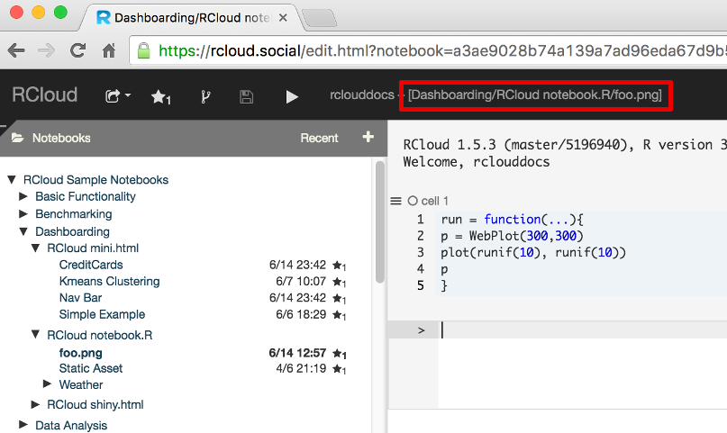

-   [{.homelogo}](../ "RCloud")
-   [Gallery](../gallery/ "Gallery"){.no-img}
-   [Tutorials](../tutorials/ "Tutorials")
-   [Documentation****](#){.dropdown-toggle}
    -   [Introduction](../documentation/)
    -   [Version 1.5](#){.dropdown-toggle}
        -   [What's New](../documentation/doc/1.5/whatsnew/doc.html)
        -   [GUI
            Documentation](../documentation/doc/1.5/guidoc/doc.html)
    -   [Version 1.4](#){.dropdown-toggle}
        -   [What's New](../documentation/doc/1.4/whatsnew/doc.html)
        -   [GUI
            Documentation](../documentation/doc/1.4/guidoc/doc.html)
    -   [Version 1.3](#){.dropdown-toggle}
        -   [What's New](../documentation/doc/1.3/whatsnew/doc.html)
        -   [GUI
            Documentation](../documentation/doc/1.3/guidoc/doc.html)
-   [Community](../community/ "Community")
-   [Try It](../tryit/ "Try It"){.blue}
-   [{.ghlogo}](https://github.com/att/rcloud){.no-img}

[Try It](../tryit/ "Try RCloud"){.trial}
{.logo} [  ](){.menu-button .clearfix}

Documentation
=============

Introduction {#introduction .gallery-header}
------------

{.img1}

RCloud is [open-source software](http://github.com/att/rcloud){.blu}
developed primarily by [Simon Urbanek](http://urbanek.info/){.blu} and
[Gordon Woodhull](http://gordon.woodhull.com/){.blu} of [AT&T
Research](http://www.research.att.com){.blu} and [Carlos Scheidegger,
University of Arizona](http://cscheid.net){.blu} to facilitate
collaboration for big data analytics and visualizations. You can test
drive the most recent release of **RCloud** by logging in as a Data
Scientist using our [Try It](../tryit/){.blu} page, or you can create a
local private RCloud; detailed instructions are provided in our [Public
versus Private (Download / Local Installation)
RClouds](../tutorials/#PvsP){.blu} tutorial.

Traditional Data Scientist environments often assume a single-developer
perspective, while data scientist teams would often benefit from
leveraging existing analyses, built-in version control, automated
recommendations, and easier sharing of code, data, annotations and
comments. RCloud provides a **notebook interface** that lets you easily
generate a web-based session, annotate it with text, equations,
supporting images and web page layout so that data scientist teams can
convert collaborative work on large complex datasets into reports and
web pages (dashboards) which may easily be shared with others.

The following paragraphs provide a bried overview of some of the unique
features of RCloud, but more detailed feature explanations are provided
in the **"WHAT'S NEW"** and **"GUI DOCUMENTATION"** sub-menu pages for
each release and more detailed technical explanations are provided in
the [RCloud Wiki](https://github.com/att/rcloud/wiki){.blu}.

### Communication Protocol {#communication-protocol .docheader1}

The RCloud ecosystem is a organized around ***notebooks***. A notebook
is a collection of R or Python scripts together with data and code
***assets*** which the scripts may rely on. Assets may be data files,
like CSV or Hierarchical Data Format (HDF) files, image files, which are
displayed as part of a user-interface, or HTML, CSS and Javascript code.

All of the elements of the notebook are stored on a Github server. The
Github server supports continual and automatic background versioning of
notebooks as they are developed and modified. This feature provides the
benefits of basic Git version control for casual users and the option to
use more sophisticated git features for advanced users.

The RCloud editor is designed as an integrated development environment
(IDE) for creating scripts to be executed and shared by internal Data
Scientists and potentially deployed for execution by any web user. The
basic architecture of the system is shown in the figure below.
{.img2}

The the system back-end depicts an RCloud server which executes code
entered at the web-browser and communicates the result back to the
browser.

RCloud was specifically designed to leverage existing systems and
standards so communication between most parts of the system happens
through HTTP. As a result, some desirable features of RCloud become
natural, such as native support for RCloud notebooks as web services.

Every notebook in RCloud is named by a URL and notebooks by default are
visible in the entire organization. This is deliberate as broad access
to analysis outputs increases long-term engagement in part through
cross-references on the web.

### Security {#security .docheader2}

The security challenge in a system like this is to allow a given
internal Data Scientist access to the full power of the R interpreter on
the server while preventing external users from executing their own
arbitrary code. RCloud has adopted the discipline known as
*Object-Capabilities* as outlined by [Mark Miller, Robust Composition:
Towards a Unified Approach to Access Control and Concurrency Control
(2006)
\[PDF\]](http://www.erights.org/talks/thesis/markm-thesis.pdf){.blu} to
arbitrate the communication of functional information between the
web-browser and the R interpreter. Object-capabilities support the
notion of mapping language functions to cryptographic hashes which act
as function proxies on the exposed client. The server then acts on these
hashes rather than on direct code, thereby preventing the client from
submitting arbitrary code to the server.

RCloud uses the [RServe
protocol](https://github.com/cscheid/rserve-js){.blu} to implement the
Object-Capabilities methodology and the client-server communication. An
RCloud session runs on both client and server and it is possible for R
functions on the server to call JavaScript functions on the client and
vice versa; see [RCloud application program interface (API) and R and
Javascript
binding](%20https://github.com/att/rcloud/wiki/R-JavaScript-binding){.blu}
for a detailed description of the browser/server interaction.

Individual notebooks are protected with privacy controls. Notebooks may
be protected through group assignments, made entirely private (readable
only by you), or made public (readable by anyone). Unlike a hidden
notebook, protected notebooks are not readable by anyone without
permission, even within your GitHub instance.

### Unique Functionality - notebook.R {#unique-functionality---notebook.r .docheader1}

RCloud notebooks may also be deployed as a web-service provider via the
[notebook.R](http://att.github.io/rcloud/doc/1.5/guidoc/doc.html#notebookrurls){.blu}
interface. This interface allows execution of any RCloud notebook, or
access to any notebook asset, by simply referencing the associated URL.
This feature also allows RCloud notebooks to be integrated with other
web-technologies simply be referencing them. For example, to generate a
dynamic web browser image, create a web page with the following HTML
&ltimg&gt; element.

    &ltimg width=300, height=300, src="http://rcloud.social/notebook.R/rclouddocs/foo.png">

Then as user 'rclouddocs' create a notebook named 'foo.png' containing
the following plotting code:
    run = function(...){
    p = WebPlot(300,300)
    plot(runif(10),runif(10))
    p 
    }

In this example the RCloud server will intercept the HTTP request for
the the &ltimg&gt; source file and return the result of the notebook, a
PNG graphics file, which will be displayed at the location of the
&ltimg&gt; element.

The `WebPlot()` function used in this example is from the [FastRWeb
\[PDF\]](https://cran.r-project.org/web/packages/FastRWeb/FastRWeb.pdf){.blu}
R package which includes several other useful functions for creating web
content with R. Our [Weather
Dashboard](http://rcloud.social/notebook.R/rclouddocs/Dashboarding/RCloud%20notebook.R/Weather/main){.blu}
illustrates how the output from individual **notebook.R** RCloud
notebooks may be used to create dashboards.

Notebooks can be executed one cell at a time in an interactive session,
similar to traditional read-eval-print loops, or can all be executed
concurrently, similar to running a shell
script.{.img4} One of the main contributions of
RCloud is the notion that notebooks are “always deployed”. In other
words, the most recent version of a notebook is immediately available to
all other users of the system. Another way to describe this is that
RCloud lacks a “save” button: any notebook cell that runs is always
associated to a notebook version serialized to disk. For more about the
goals, architecture and design of RCloud see [Stephen North, et. al.,
Collaborative Visual Analysis with RCloud (2013)
\[PDF\]](http://www.research.att.com/export/sites/att_labs/techdocs/TD_101623.pdf){.blu}.

©Copyright
RCloud
-   [{.ftrhomelogo}](../ "RCloud")
-   [Gallery](../gallery/ "Gallery")
-   [Tutorials](../tutorials/ "Tutorials")
-   [Documentation](#wrapper "Documentation")
-   [Community](../community/ "Community")
-   [Try It](../tryit/ "Try It"){.blue}
-   [{.ghlogo}](https://github.com/att/rcloud){.footr}

