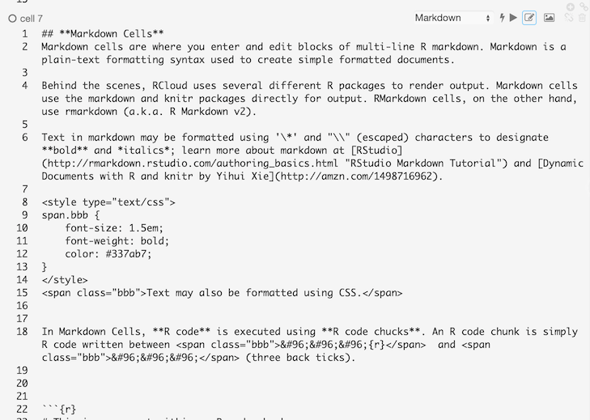

Cells
=====

There are two types of cells in RCloud. The first is the **prompt** cell, which
allows you to interact with RCloud in more-or-less command-line fashion. Prompt
cells are useful for quick, interactive sessions.

RCloud supports several cell languages: R, Python2 and 3, and Bash (shell),
which you can specify in the pull-down menu to the right of each cell:


There may be other languages available on your instance, since any Jupyter
kernel is available as an RCloud cell language.

The second type is the **markdown** cell. Markdown cells are better suited for
cutting and pasting chunks of R code and adding simple formatted documentation.
Note that Markdown cells do not currently support Python or Bash.

We'll get to the difference between Markdown and RMarkdown cells in a moment.

"Data marshalling," or sharing results between cells of different languages, is
not supported at this time -- one common workaround is to write and read files.
Also, each "shell" cell represents a separate Unix shell, so environment
variables cannot be passed across shell cells. However, R environment variables
defined in R cells are inherited by shell cells automatically.

Prompt cells
------------

<a href="img/promptcell.png"></a>

Prompt cells mimic an interactive R, Python, or Bash shell. Type a line of code, press `Enter/Return`, and the command is immediately executed. When RCloud is finished, it presents the result and a new prompt cell.

For example, here's the result of pressing `Enter/Return` after typing a command:


Note that after executing a command, RCloud presents several icons that allow you to interact with the cell:

: Run the code in the cell.

: Edit the code in the cell (clicking on your code also enables editing).

: Toggles the
result pane.

: Split the cell into two parts at the cursor.

: Delete the cell.

Another way to interact in multi-line mode with prompt cells is to cut and paste multiple lines of code into the cell. When you do, you'll see something like this:

<a href="img/multilinerpromptpaste.png"></a>

To execute the code, press `Enter/Return`. The whole block of code is executed, wherever the cursor is.

Note that you cannot insert a prompt cell above an existing prompt cell. The only way to add new prompt cells is by executing the current prompt cell. When you do, a new cell is created under the existing one.

### Terminology

Throughout this documentation, prompt cells are sometimes referred to as R cells, Python cells, or Bash cells.

Markdown cells
--------------

<a href="img/markdowncell.png"></a>

### Adding Code

Markdown cells are where you enter and edit blocks of multi-line R markdown. Markdown is a plain-text formatting syntax used to create simple formatted documents. In order to differentiate your R code from text, surround your code with the following (back ticks, brackets and "r"):

    ```{r}
    ## R code goes here
    print("Hello World!")
    ```

For additional information about Markdown, please refer to the [full documentation of Markdown syntax](http://daringfireball.net/projects/markdown/syntax).

When you're done editing a markdown cell, click the  icon to the right of the cell to render the contents of the cell.

Editing and viewing results
---------------------------

If you find a typo or would like to otherwise edit your code, click the  icon. You can also click on any code portions of the output to enter edit mode.

### Navigation

At the beginning or end of a cell's code, use the up and down arrow keys to jump to the next or previous cell.

Adding and deleting cells
-------------------------

To insert a cell above, click the  icon. To insert a cell below, click the  icon. To delete a cell altogether, click the  icon.

Cell run-state indicator
------------------------

The run state of each cell is displayed via an icon in between the gutter and cell name:

: The cell has not been run. This could also mean that the cell ran successfully, but the output may not be consistent with the code in the cell because the code was modified after RCloud initiated a run of your notebook.

: The cell is queued to be run.

: RCloud initiated a run of your notebook, but a cell's code was modified after execution was initiated.

: The cell is running.

: The cell is running, but because the code was modified after notebook execution was initiated, the output may not be consistent with the code.

: The cell ran successfully.

: The cell ran but had errors.

: The cell's run was cancelled.

Stopping cell execution
-----------------------

See the [Header bar](#header-bar) section for more details about stopping cell
execution.

Rearranging cells
-----------------

To rearrange your cells, click and drag the blank status area above the cell.

Joining cells
-------------

To join cells of the same flavor, click the join icon at the right of the cell. This will combine the contents of the cell with the cell immediately above it.


Markdown versus RMarkdown cells
-------------------------------

Behind the scenes, RCloud uses several different R packages to render output. Markdown cells use the [Markdown](http://cran.r-project.org/web/packages/markdown/index.html) and [knitr](http://yihui.name/knitr/) packages directly for output. RMarkdown cells, on the other hand, use [rmarkdown](http://rmarkdown.rstudio.com/) (also known as R Markdown v2).

Saving plots
------------

Hover the mouse over a plot created in an R cell to make the disk icon appear in the upper right corner (see 1), which contains a list of available image formats. A widget at the lower-right corner can be used to resize the image (see 2).

<a href="img/saveresize.png"></a>

Note that you can only save plots created in R cells.

Locators
--------

RCloud supports the standard R [`locator()`](https://stat.ethz.ch/R-manual/R-devel/library/graphics/html/locator.html) function. When the locator is active, RCloud adds a blue border around the plot and changes the cursor to a crosshair.

To add points, left click anywhere on the plot. To end or abort a locator request, press the `Esc` key. Once you have selected your locations, `locator()` returns the points clicked:

<a href="img/locator_res.png"></a>

Locators only work in R cells.

