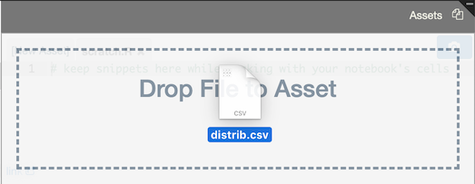

Notebook assets
===============

Notebooks can contain "assets," which are files that can be used within your notebooks or simply for keeping track of unused code (as in the the case of `scratch.R`, which is a text file where you can keep bits of code while working on your notebook).

Data as an asset
----------------

For example, here is the content of a file called distrib.csv:

    a,1
    b,15
    c,4

We can store this data in a new asset called `distrib.csv` simply by clicking New Asset and typing `distrib.csv` as a name.

Now, this data is accessible in your R code:

Uploading assets
----------------

In addition to manually entering asset text, you can also drag and drop files into the Assets panel to upload them:

Assets Links
------------

RCloud automatically generates asset links and displays them in the lower left-hand corner of the Assets panel. To copy the URL, right-click on it.

Binary Assets
-------------

Assets can be binary (e.g. an image). RCloud transparently encodes and decodes using base-64 encoding. When possible, the content is displayed in its native format in the asset panel.

Asset size
----------

Assets are limited to 2.5MB each.

Cascading style sheets
----------------------

Assets can contain CSS formatting information. This changes the way information is presented when your notebook is executed. For example, here is a bit of CSS that defines a paragraph style:

    p.mystyle {
      font-size: 20px;
      color: red;
    }

To use this CSS as an asset, it needs to have a special name that begins with "rcloud-" and ends with ".css". In the example below, the name is "rcloud-mystyle.css".

RCloud automatically uses CSS asset files with this file pattern and ignores others, so you can save bits of CSS in other files without worrying about overlap.

To use the `mystyle` paragraph style, simply reference it in Markdown using HTML:

    # My Header

    Here is a bit of red text:

    
This is red.

Note that you must reload your notebook to apply the CSS.

JavaScript
----------

Assets can also contain JavaScript. When editing JavaScript (files must have the .js extension), RCloud automatically uses a JavaScript editing mode, which has built-in syntax checking.

HTML Mode
---------

When editing HTML (files must have the .html or .htm extension), RCloud automatically uses an HTML editing mode, which has built-in syntax checking and tag completion.

Renaming assets
---------------

To rename an asset, simply click on the file name on the asset's tab.

