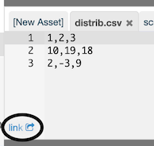

`notebook.R` URLs
=================

It's possible to construct a URL for a notebook asset accessing the GitHub or rcloud-gist-services backend directly, but this is cumbersome.

A better and more powerful way to access assets is via the HTTP entry point, `notebook.R`.

You can find the URL of the currently open asset by right-clicking the link at the lower left corner of the asset editor.

`notebook.R` allows you to access a notebook in the following ways:

    http://rcloud.mydomain.com/notebook.R/<notebook-id>
    http://rcloud.mydomain.com/notebook.R/<notebook-id>/<version-hash>
    http://rcloud.mydomain.com/notebook.R/<notebook-id>/<filename>
    http://rcloud.mydomain.com/notebook.R/<notebook-id>/<version-hash>/<filename>
    http://rcloud.mydomain.com/notebook.R/<user>/<notebook-name>
    http://rcloud.mydomain.com/notebook.R/<user>/<notebook-name>/<filename>

URLs ending in "&lt;filename&gt;" will return the given asset (file). To illustrate how it works using the previous example, any of these give HTTP access to the latest version of DummyData.csv:

    http://rcloud.mydomain.com/notebook.R/d2b9231aca224bbbb888/DummyData.csv
    http://rcloud.mydomain.com/notebook.R/rclouddocs/Asset%20API/DummyData.csv

Access to assets isn't the only thing you can do with `notebook.R`. Notice that in the list of ways to access your notebook above, not all methods reference a filename. If you reference a notebook or revision of a notebook, the URL will return the final result after evaluating the R cells in the notebook.

`notebook.R` is intended to be a general-purpose Remote Procedure Call (RPC) in R. RPCs in RCloud should always contain some [Markdown](#Markdowncells) to document what the RPC does, what the arguments are, etc. This way other users can simply view your notebook in RCloud to understand how to use it. This isn't enforced but is encouraged to promote reuse. The Markdown is only visible when users visit your notebook in RCloud. The Markdown is not output when called remotely.

Please see [the following](https://github.com/att/rcloud/blob/develop/NEWS.md#rcloud-09) for more `notebook.R` features and information.

