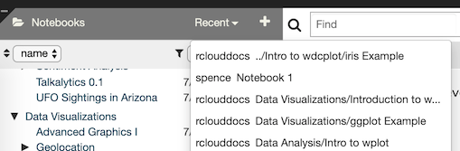
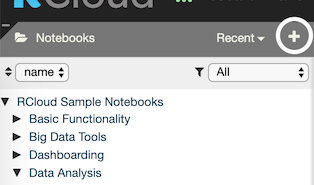
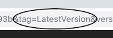
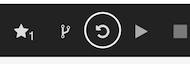
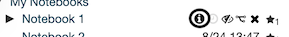
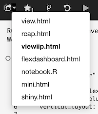
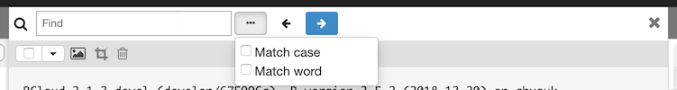
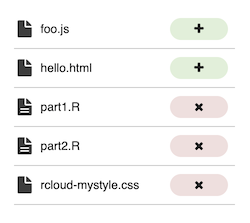

Notebooks
=========

RCloud notebooks are simply collections of prompt and Markdown cells (as well as comments and assets, both of which we'll get to later). Everything in your public notebooks is searchable by every other user of the system. This encourages reuse and makes learning how to use the hundreds of available R packages somewhat easier.

You can also browse everyone else's notebooks by opening the Notebooks section on the left sidebar. To do this, simply click on Notebooks at the top of the panel. This toggles the panel, opening or closing it:

Sorting and filtering notebooks
-------------------------------

Below the Notebooks panel is a header containing two drop-down menus. Click the
left-most button to sort the notebooks panel by name or by date. Click the
right-most button to filter out older notebooks. E.g. Only show notebooks for
the past week, month, year, and so on.

Loading a notebook
------------------

To load a notebook into the current session, click on the name. After it loads, you can examine the source code or click  in the header bar to execute all the cells on the page.

Recent Notebooks
----------------

Access your recently opened notebooks via the Recent link in the Notebooks titlebar:

Creating a notebook
-------------------

To create a new, blank notebook, click the + sign at the right of the Notebooks panel header area:

RCloud will automatically choose a title for your new notebook, Notebook N, where N is the next available number among your notebooks. To give your notebook a more meaningful title, click on the [title in the header bar](#header-bar).

To change the default name of new notebooks, see the [New Notebook Prefixes](#new-notebook-prefixes) section in the Settings panel.

Running a notebook
------------------

To run all the cells in your notebook, click the  icon in the header bar.

RCloud notebooks are executed asynchronously. RCloud will show individual cell results as the results are ready to display.

To run only selected cells, hold down the `Ctrl/Cmd` key when you click the  icon in the header bar. See the [Multi-Cell Selection](#multi-cell-selection) section for more information about multiple-cell selection.

### Partial notebook runs

Pressing the  icon in a cell while holding down the `Shift` key will run that cell and every cell after in order.

Long-running notebooks
----------------------

Notebooks that run longer than a few seconds will cause the browser screen to dim and a please-wait message to be displayed.

Currently, RCloud has no explicit mechanism to stop a long-running notebook. If you mistakenly launch a long-running notebook, you can simply reload the notebook in another browser tab or reload the page. This doesn't stop the execution behind the scenes, but the output of the previous run will not interrupt your current session. Be careful of side-effects, like changing the contents of a file in your local directory in such a way that it affects the output of the notebook.

Forking (copying) a notebook
----------------------------

To copy another user's notebook, first navigate to it using the left sidebar and then click to load it into your current session. Now, you're running another user's public notebook in your own session. This is sufficient for running reports or performing other read-only activities. If you want to edit the notebook, you'll need to make your own copy, or, "fork" it.

After you've loaded the notebook you want to fork, click the Fork icon in the header bar at the top of the screen:

After forking a notebook, you'll own your own copy and be able to edit it.

The fork icon is always available, which means you can fork your own notebooks. If you are viewing a previous version of a notebook, you can fork a copy of that version.

Unfortunately, due to the design of GitHub Gists, when you fork your own notebook, the copy's history is lost. This limitation is not found when using the [rcloud-gist-services](https://github.com/att/rcloud-gist-services) backend.

Saving your work
----------------

### Versioning

RCloud keeps track of your notebook versions automatically and frequently. Every time you save, create, or run a Markdown or Prompt cell, the newest version of your notebook is saved. To browse different versions of your notebook, which are stored chronologically with the latest version on top, hover over the name of your notebook in the left sidebar and click the clock icon. A drop-down list of versions will appear:

To change they way dates and times are displayed next to your notebook versions, see the [show terse version dates](#show-terse-version-dates) setting.

#### Version Tagging

To tag a notebook version, click twice on a version name to edit it in place.

Now, rather than referring to a specific notebook version with `&version=hash` in a URL, you can refer to a specific notebook tag:

`&tag=name`

This is useful when you want to share a version of a notebook but plan to continue developing it. For example, you can tag a version as the "LatestProductionVersion," and then apply that tag to another version when you're ready to share your new work. This way, existing URLs (perhaps stored in someone's bookmarks) won't break as you update your notebooks.

#### Reverting to a previous version

Should you decide that a previous version of your notebook is the "best" version, you can make that version the current version by first loading the desired previous version of the notebook and then clicking the revert icon in the header bar.

Hidden notebooks
----------------

By default, all RCloud notebooks are visible to all RCloud users. If you'd like to toggle the Show/Hide flag on a notebook, hover over the name of your notebook on the left sidebar and click the eye icon. Note that hidden notebook titles are grayed out for owners and invisible to other users.

Hidden notebooks are only invisible within the RCloud interface. Hidden notebooks are still visible within the gists stored in your GitHub instance.

### Toggle hidden

Clicking the  icon will hide your notebook from other RCloud users.

### Toggle show

Clicking the  icon will make your notebook readable by other RCloud users.

Protecting your notebooks
-------------------------

Protected notebooks are readable only by the owner and (optionally) a select group of users and will not show up in search results (although previously unprotected versions can).

### Notebook permissions

View or modify notebook protection by clicking the notebook "info" button next to the notebook name in the notebooks tree:

If you own the notebook, click the "public" link (or "no group" if that displays):

This opens the notebook protection dialog:

Here, you can assign the notebook to any group you are a member of, make it entirely private (readable only by you), or make it public (readable by anyone).

### Groups

Use the second tab of the protection dialog to create or rename groups. Additionally, you can designate other users as group administrators or members. Alternatively, you can select Manage Groups from the Advanced menu item on [the header bar](#header-bar) -- note that the Notebook tab will be grayed out in that case, as Manage Groups is not notebook specific.

Unlike a hidden notebook, protected notebooks are not readable by anyone without permission, even within your GitHub instance.

Deleting Notebooks
------------------

To delete a notebook, hover over the name of your notebook in the left sidebar and click the  icon.

RCloud will ask for a confirmation:

Click OK. The notebook will disappear from the left sidebar. The last-viewed available notebook will automatically load into the current session.

Sharing your notebooks
----------------------

There are several ways you can share/view your notebooks. When you click on the downward arrow next to the share icon in the header bar , a popup menu will appear:

Here, you select the kind of URL you'd like to share. Make your selection using the popup menu and then right click on the  icon to copy the hyperlink.

Clicking on a selection in the sharing menu will open a new browser tab and load the selected link.

Note that if you have a tagged version of your notebook currently loaded, where appropriate, RCloud will populate the shared URL with the tag instead of the version. This is beneficial because then you can tag future versions with the same tag and not break existing URLs.

### `view.html`

This is the simplest method. This will create a link that will allow someone to see the notebook code and execute the notebook within the RCloud IDE. Users who do not own the notebook will see the play  and share  icons in the header. Clicking the play icon will execute all cells in the notebook. Clicking the edit icon will return to the normal header, allowing a user to fork the notebook, etc.

#### Hiding UI Elements

To hide *all* UI elements, add `&quiet=1` to the URL. Note that this works only with `view.html`.

### `flexdashboard.html`

View a notebook containing R Markdown for a [flexdashboard](https://rmarkdown.rstudio.com/flexdashboard/).

### `notebook.R`

This option is intended for [FastRweb](http://rforge.net/FastRWeb/) notebooks. Loading the URL (from anywhere, including other notebooks, a perl script, etc.) executes a notebook "behind the scenes" by opening a one-time R session, running the defined "function" within, shutting down the R session, and finally, returning the result. FastRweb notebooks MUST have a function named `function()` defined, as this is what notebook.R tries to execute upon instantiation. Output from `notebook.R` can be anything (e.g. text, binary data). This information will ultimately be processed by whatever mechanism called `notebook.R`.

`notebook.R` allows trailing paths to be processed by the notebook code if they start with `/.self/`. The subsequent path portion is passed to the run function as the `.path.info` argument. This allows notebooks to handle a "full tree" argument to the notebook on top of a single notebook URL.

E.g.: `https://rcloud.mydomain.com/notebook.R/user/notebook/.self/foo/bar` will call the notebook with `.path.info` set to `/foo/bar`. Note that the `.self` part distinguishes asset look up from a path info call.

See the [notebook.R URLs](#notebook.r-urls) section of the documentation for more detailed information about `notebook.R` URLs.

### `mini.html`

Unlike `notebook.R`, `mini.html` URLs open an R session via a WebSocket and keeps it open. `mini.html` notebooks must have a function named `rcw.result()` defined, as that is what `mini.html` tries to execute upon instantiation. Because the R session is kept open, users or processes can interact with the R session while the websocket is open.

### `shiny.html`

RCloud supports the [RStudio Shiny web application framework](http://shiny.rstudio.com/). To share [Shiny-enabled notebooks](#rstudio-shiny-support), select this option.

Who starred my notebook?
------------------------

To find out which users starred your notebook, click the notebook information icon:

Multi-cell selection
--------------------

You can use RCloud's multi-cell selection features to perform various actions on many cells at once.

-   At the top of your loaded notebook, you'll find a header bar. Click the checkbox to select/deselect every cell in your notebook (1).
-   Click a cell's header to select that cell. Note that clicking the header of a selected cell does not deselect the cell (2).
-   Click a cell's checkbox to select/deselect that cell (3).
-   Click the  icon to hide the output of selected cells. Note that this feature is only available with your own notebooks (4).
-   Click the  icon to remove every cell that isn't selected (4).
-   Click the  icon to delete all selected cells. Note that RCloud will indicate how many cells are selected out of the total number of cells (4).

Use the checkbox dropdown menu to fine-tune your selection:

-   **All** selects every cell in your notebook.
-   **None** deselects every cell in your notebook.
-   **Invert** changes every selected cell to a deselected cell and every deselected cell to a selected cell.

Multi-cell selection supports common keyboard extensions:

-   **Shift-clicking** a cell's checkbox will select all cells between the last selected checkbox and the current checkbox.
-   **Ctrl/command-clicking** a cell's checkbox is functionaly equivalent to checking a cell's checkbox and is noted here because it is a common selection activity.
-   Pressing the **delete key** will delete all selected cells.
-   **Ctrl/command-k** will crop (remove) all unselected cells.
-   **Ctrl/command-Shift-i** will invert the selection (select deselected cells and deselect selected cells)

Find and find replace
---------------------

To **find** text within your notebook, type `Ctrl-F` (Win/Linux) or `Cmd-F` (Mac) to open a find dialog at the top of your notebook:

To make a search match the case or use whole words (as opposed to including
partial words inside others), click the elipsis icon next to the Find text box
and make your selection.

To **find and replace** text within your notebook, type `Ctrl-H` (Win/Linux) or `Cmd-Option-F` (Mac) to open a find and replace dialog at the top of your notebook:

## Merging notebooks

To merge two notebooks, for example, to merge from notebook "B" into the
currently loaded notebook "A":

Click the "Merge From" icon next to notebook B:

Alternatively, you can also select "Merge Notebook" from the
[Advanced](#advanced-notebook-features) header-bar menu. This will open a dialog
where you can specify the source of notebook B. Currently URLs, files, and
notebook IDs are supported:

In either case, RCloud presents a Merge dialog. On the left is the list of
assets or cells which need to be changed to merge the two notebooks:

By clicking in that panel, you can choose to accept or not accept the changes
for that file.

Any cells or assets with the same name in both the source and the destination
notebooks will appear as yellow in the left pane:

Choose whether or not to take individual changes to the file in the right pane:

When you're happy with the changes, click the blue Merge button and all the
changes will be applied in one commit to the current notebook. (You can always
Undo and Revert if it didn't work right.)

## Advanced notebook features

Find more advanced notebook features by clicking the Advanced menu in the header
bar.

-   **Open in GitHub**: Internally, notebooks are stored as GitHub "gists."
    Depending on your installation, you can view your notebook gist within
    GitHub directly. This entry is grayed out for installations using the
    [RCloud Gist Service](https://github.com/att/rcloud-gist-services) because
    it isn't implemented yet.
-   **Merge Notebook**: Merge changes from another notebook into the currently
    loaded notebook. Please see the [Merging notebooks](#merging-notebooks) section
    for more information.
-   **Load Notebook by ID**: Replace the current notebook with another via URL
    or gist ID.
-   **Pull and Replace Notebook**: Opens a dialog box where you can tell RCloud
    to copy the contents of an existing notebook (within the same RCloud
    instance) via URL, file, or ID and replace the contents of the current
    notebook.
-   **Import External Notebooks**: Opens a dialog where you can import multiple
    notebooks stored in another GitHub repository. You'll need the source GitHub
    repository API URL and a list of notebook IDs, newline separated. In
    addition, you can supply a prefix that will cause all the imported notebooks
    to go into a folder. E.g. "myfolder/". Note that a trailing '/' character is
    required for this to work.
-   **Export Notebook to File**: Your browser will automatically save a copy of
    the current notebook in JSON format in whatever directory you've designated
    for downloads. The file name will be the same as your notebook with a
    `.gist` extension.
-   **Import Notebook from File**: In order to import a notebook, it must be in
    either `.gist` (see above) or `.R` (see below) format. You can validate the
    notebook by clicking the word "Validate." To import, click the Import
    button.
-   **Export Notebook as R Source File**: Your browser will automatically save a
    copy of the current notebook as an R source text file in whatever directory
    you've designated for downloads. The file name will be the same as your
    notebook with a `.R` extension.
-   **Manage Groups**: Opens the Notebook Permissions / Group Management dialog,
    where you can [manage your groups](#protecting-your-notebooks).
-   **Publish Notebook**: By default, users who wish to view your notebooks must
    be logged into RCloud. If the Publish Notebook box is checked, *any* user
    who has network access to the notebook's URL will be able to view the
    notebook. Editing features will be turned off for these users.
-   **Import Rmarkdown File**: Imports Rmarkdown containined in a `.Rmd` file.
-   **Export Rmarkdown File**: Your browser will automatically save a copy of
    the current notebook as an `Rmd` text file in whatever directory you've
    designated for downloads. The file name will be the same as your notebook
    with a `.Rmd` extension.
-   **Import Jupyter Notebook**: Imports a [Jupyter notebook](https://jupyter.org/) from your local file system.
-   **Export as Jupyter Notebook**: Exports a [Jupyter notebook](https://jupyter.org/) as an `.ipynb` file to your local file system.

