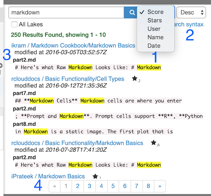

Search
======

To conduct a global text search in all public RCloud notebooks, open up the search panel by clicking on Search on the left sidebar. Here are the results for a search on "markdown." RCloud searches code, comments, notebook names, assets, everything.

**1**: Results can be sorted by the number of stars a notebook has, the author of the notebook (User), the notebook's name, or by the date a notebook was created.

**2**: Sorts the results in descending (Desc) or ascending (Asc) order.

**3**: When too many results are returned for any one notebook, RCloud will display a Show me more link that will toggle the rest of the results.

**4**: Search results are paginated. Click on any page number below the results or use the  back or  next page to page through the results.

Complex searches
----------------

RCloud supports Lucene's feature-rich query parser syntax for more complex searches. Features include wildcard, fuzzy, and proximity searches, boolean operators, grouping, and much more.

Please see the [official query parser syntax documentation](http://lucene.apache.org/core/2_9_4/queryparsersyntax.html) for more information.

