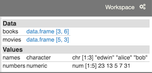

Workspace
=========

In the course of working with your notebook, variables are defined and assigned. Often, it is convenient to know the value of a variable without issuing a command to display it. The Workspace panel displays every variable you've defined along with its value.

In the case of dataframe variables, a link is displayed, which will open up the [Dataframe panel](#dataframe).

